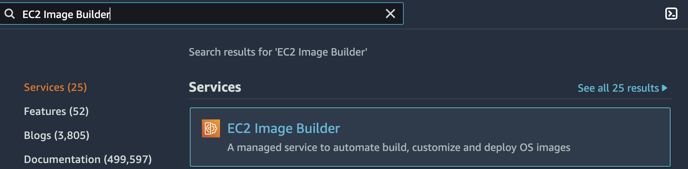
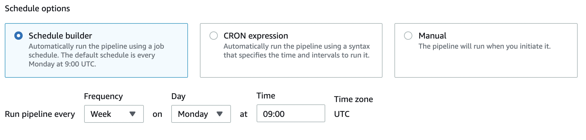
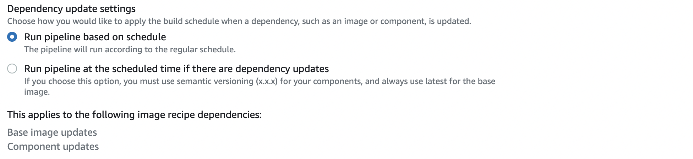
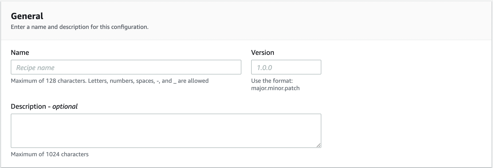
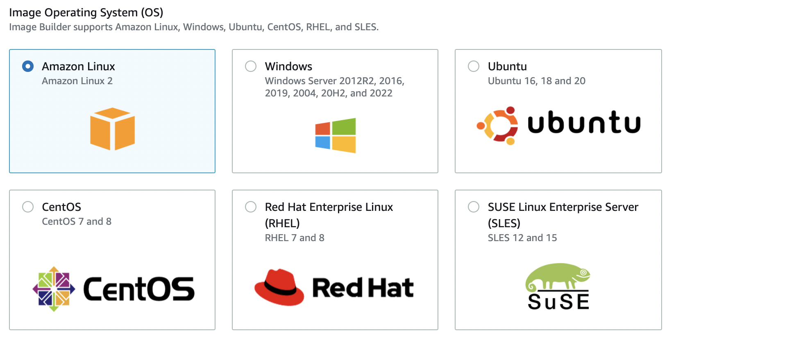
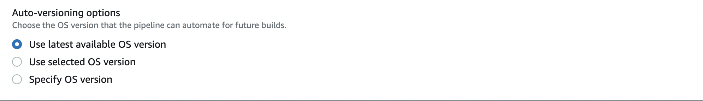
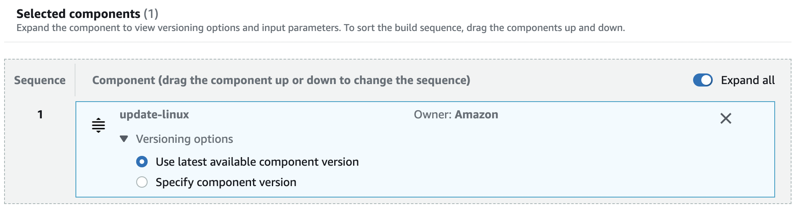
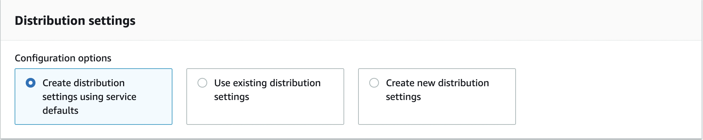
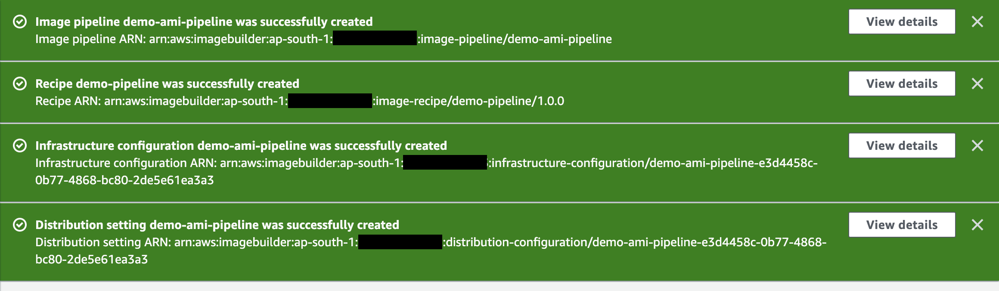
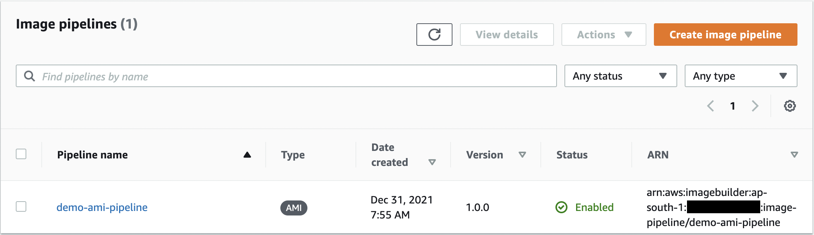

## Ec2 Image pipeline using AWS EC2 Image Builder

**Introduction**
- EC2 Image Builder is a wholly managed AWS service that simplifies the process to automate the creation, management, and deployment of tailored, secure, and up-to-date server images that are pre-installed and pre-configured with software and settings to match specific IT standards.
- Features of EC2 Image Builder

   - Greater productivity and reduced operations for building compliant and up-to-date images
   - The more excellent service uptime
   - Improved the security standard for deployments
   - Centralized enforcement and lineage tracking
   - Simplified sharing of resources across AWS accounts

**How EC2 Image Builder works?**
- When you leverage the EC2 Image Builder services to create a custom image, a wizard guides you through the following steps.

   - **Provide pipeline details**: Enter details about your pipeline, such as a name, description, tags, and a schedule to run automated builds.
   - **Select recipe**: Select from building an AMI or building a container image.
   - **Provide infrastructure configuration**: Image Builder launches EC2 instances in your account to customize images and run validation tests.
   - **Provide distribution settings**: Select the AWS Regions to distribute your image to after the build is complete and has passed all its tests
 
        

**Tutorial**
- This tutorial walks you through creating an automated pipeline to build and maintain a customized EC2 Image Builder image using the Create image pipeline wizard. To simplify the demo, default settings are used when available, and optional sections are skipped.
- Deploy image pipeline workflow

   - Step 1: Provide pipeline details
   - Step 2: Select recipe
   - Step 3: Provide infrastructure configuration - optional
   - Step 4: Provide distribution settings - optional
   - Step 5: Review
   - Step 6: Clean up

   **Step 1: Provide pipeline details**

     - Traverse to the <a href="https://console.aws.amazon.com/imagebuilder/">EC2 Image Builder console</a> 

          

     - To initiate creating your pipeline, select Create image pipeline.

        

     - In the General section, provide your Pipeline name (required).

        

     - In the Build schedule section, you can keep the defaults for the Schedule options. Note that the Time zone is Universal Coordinated Time (UTC). 

        

     - For Dependency update settings, select the Run pipeline at the scheduled time if there are dependency updates option. This setting will lead your pipeline to check for updates before starting the build. If there are no updates, it skips the scheduled pipeline build

        

     - Choose Next to proceed to the next step.

   **Step 2: Select recipe**

     - Image Builder defaults to Use existing recipe in the Recipe section. Choose the Create new recipe option.

     - In the Image type section, select the Amazon Machine Image (AMI) option to create an image pipeline that will generate and distribute an AMI. 

        

     - In the General section, enter the following required boxes:

        - Name – your recipe name

        - Version – your recipe version.

        

     - Select image: You can select the base image from a list of Image Builder managed images or Amazon Machine images (AMIs) that your account has access to or import a virtual image.

        

     - Image Builder supports Amazon Linux, Windows, Ubuntu, CentOS, RHEL, and SLES. Under Image Operating System (OS), select Amazon Linux from the list.

        

     - Choose the image to configure from a list of previously created pipeline images, images shared with you or a quick start list to help you get started. You could also enter a custom AMI ID to define the base image. Under Image origin, select Quick start (Amazon-managed).

          

     - From the Image name dropdown, choose an image.

        

     - Keep the default for Auto-versioning options (Use the latest available OS version).

        

     - Keep the default values for the Systems Manager agent. Image Builder removes the Systems Manager agent after the build and tests are complete before creating the new image.

        

     - Keep User data blank for this tutorial. You can use this area at other times to provide commands or a command script to run when you launch your build instance. When using it, make sure that the Systems Manager agent is pre-installed on your base image or that you include the install in your user data.

        

     - Keep the default for Working directory options (Use /tmp as Working directory path).

         

     - In the Components section, you must choose at least one build component. Under Build components – Amazon Linux panel, you can browse through the features listed on the page. For this tutorial, choose a feature that updates Linux with the latest security updates, as follows:

       - Filter the results by entering the word update in the search bar located at the top of the panel.

       - Select the check box for the update-linux build component.

         
      
       - Scroll down, and in the upper right corner of the Selected components list, choose Expand all.
      
       - Keep the default for Versioning options (Use latest available component version).

         

     - Choose Next to proceed to the next step.

   **Step 3: Provide infrastructure configuration - optional**

     - Image Builder launches EC2 instances in your account to customize images and run validation tests. The Infrastructure configuration settings specify infrastructure details for the instances that will run in your AWS account during the build process.

     - In the Infrastructure configuration section, the Configuration options default to Create infrastructure configuration using service defaults. It creates an IAM role and associated instance profile used by building instances to configure your EC2 AMIs. You can also create your custom infrastructure configuration or use settings that you have already made. For this tutorial, we are using the default settings.

        

     - Choose Next to proceed to the next step.

        

   **Step 4: Provide distribution settings - optional**

     - Distribution settings involve specific Region configuration for encryption, launch permissions, accounts that can launch the output AMI, the output AMI name, and license configurations.

     - In the Distribution settings section, the Configuration options default to Create distribution settings using service defaults. This option will distribute the output AMI to the current Region. Here, we are using the default settings.

        

     - Choose Next to proceed to the next step.

        

   **Step 5: Review**

     - The Review section displays all of the settings you have configured. To correct information in any given area, select the Edit button located in the top right corner of the step section. 

     - When you have verified your configuration, select Create pipeline to create your pipeline.

        

     - You can see success or failure messages at the top of the page, as your resources are deployed for distribution settings, infrastructure configuration, your new recipe, and the pipeline. To see details for a resource, including the resource identifier, choose View details.

       

       

   **Step 6: Clean up**

     - Ensure to clean temporary resources that you created for testing periodically. Otherwise, you might forget about those resources and later not remember what they used them.
