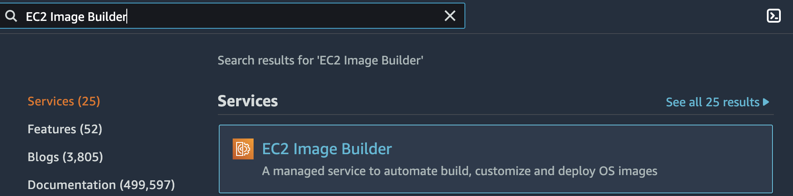
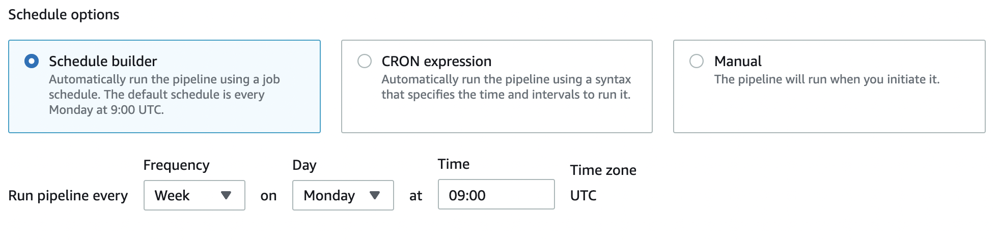
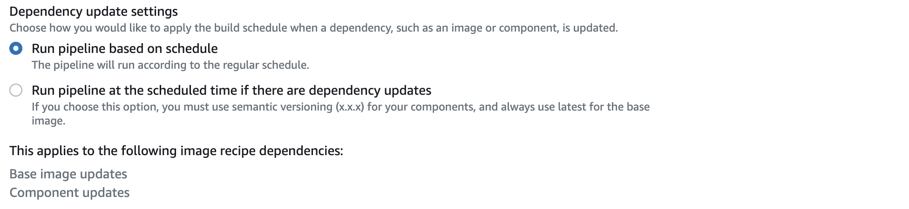
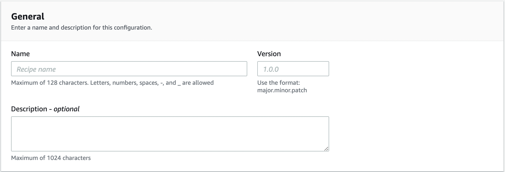
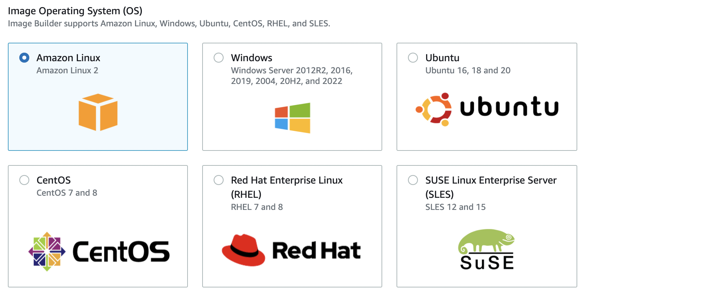
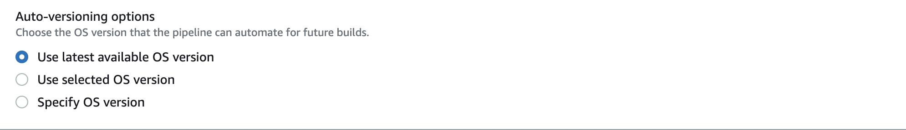
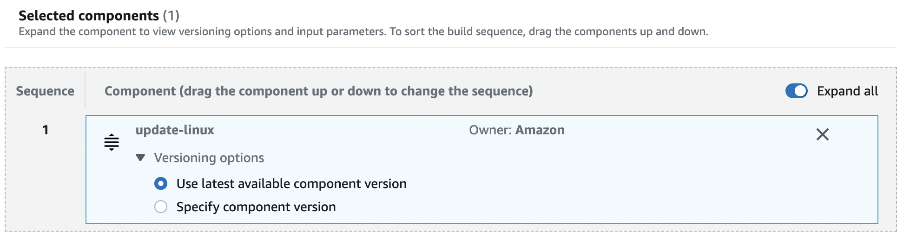
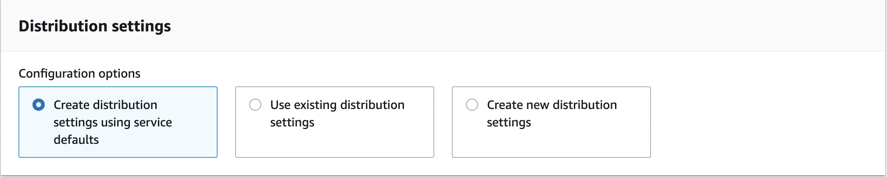
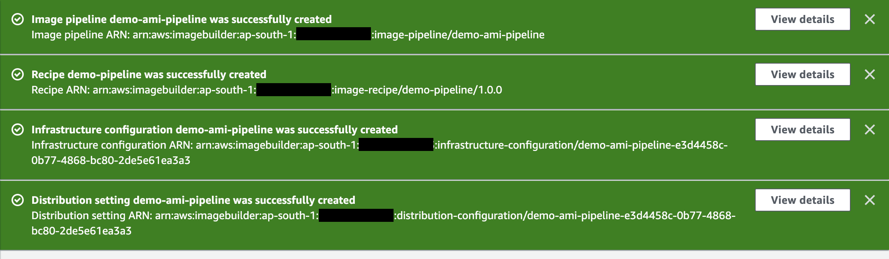
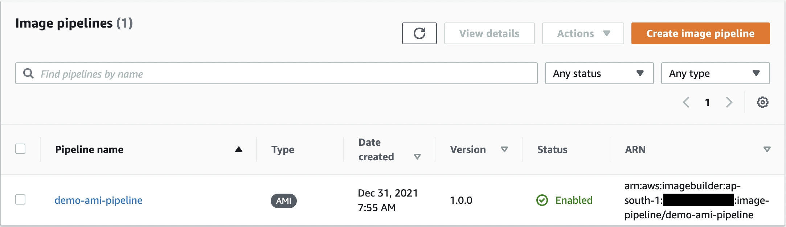

## Create an image pipeline using the EC2 Image Builder console

**Introduction**
- EC2 Image Builder is a fully managed AWS service that makes it easier to automate the creation, management, and deployment of customized, secure, and up-to-date server images that are pre-installed and pre-configured with software and settings to meet specific IT standards.
- Features of EC2 Image Builder

  - Increase productivity and reduce operations for building compliant and up-to-date images
  - Increase service uptime
  - Raise the security bar for deployments
  - Centralized enforcement and lineage tracking
  - Simplified sharing of resources across AWS accounts

**How EC2 Image Builder works?**
- When you use the EC2 Image Builder pipeline console wizard to create a custom image, a wizard guides you through the following steps.

  - **Specify pipeline details**: Enter information about your pipeline, such as a name, description, tags, and a schedule to run automated builds.
  - **Choose recipe**: Choose between building an AMI, or building a container image.
  - **Define infrastructure configuration**: Image Builder launches EC2 instances in your account to customize images and run validation tests.
  - **Define distribution settings**: Choose the AWS Regions to distribute your image to after the build is complete and has passed all its tests

**Tutorial**
- This tutorial walks you through creating an automated pipeline to build and maintain a customized EC2 Image Builder image using the Create image pipeline console wizard. To help you move through the steps efficiently, default settings are used when they are available, and optional sections are skipped.
- Create image pipeline workflow

  - Step 1: Specify pipeline details
  - Step 2: Choose recipe
  - Step 3: Define infrastructure configuration - optional
  - Step 4: Define distribution settings - optional
  - Step 5: Review
  - Step 6: Clean up

  **Step 1: Specify pipeline details**

  - Traverse to the <a href="https://console.aws.amazon.com/imagebuilder/">EC2 Image Builder console</a> 

      

  - To begin creating your pipeline, choose Create image pipeline.

    

  - In the General section, enter your Pipeline name (required).

    

  - In the Build schedule section, you can keep the defaults for the Schedule options. Note that the Time zone shown for the default schedule is Universal Coordinated Time (UTC). 

    

  - For Dependency update settings, choose the Run pipeline at the scheduled time if there are dependency updates option. This setting causes your pipeline to check for updates before starting the build. If there are no updates, it skips the scheduled pipeline build

    

  - Choose Next to proceed to the next step.

  **Step 2: Choose recipe**
  
  - Image Builder defaults to Use existing recipe in the Recipe section. Choose the Create new recipe option.
  
  - In the Image type section, choose the Amazon Machine Image (AMI) option to create an image pipeline that will produce and distribute an AMI. 
    
    
  
  - In the General section, enter the following required boxes:
    
    - Name – your recipe name
    
    - Version – your recipe version.

    

  - Select image: You can select the base image from a list of Image Builder managed images or Amazon Machine Images (AMIs) that your account has access to or import a virtual image.
    
    

  - Choose the image to configure from a list of previously created pipeline images, images shared with you or a quick start list to help you get started. You could also enter a custom AMI ID to define the base image. Under Image origin, select Quick start (Amazon-managed).
  
    
    
  - Under Image origin, select Amazon Linux from the list Amazon Linux, Windows, Ubuntu, CentOS, RHEL, and SLES.
  
      
   
  - From the Image name dropdown, choose an image.
    
    
  
  - Keep the default for Auto-versioning options (Use latest available OS version).
    
    
  
  - Keep the default values for the Systems Manager agent. This results in Image Builder removing the Systems Manager agent after the build and tests are complete, before creating the new image.

    

  - Keep User data blank for this tutorial. You can use this area at other times to provide commands, or a command script to run when you launch your build instance. When you do use it, make sure that the Systems Manager agent is preinstalled on your base image, or that you include the install in your user data.

    
    
  - Keep the default for Working directory options (Use /tmp as Working directory path).
    
     
 
  - In the Components section, you must choose at least one build component. Under Build components – Amazon Linux panel, you can browse through the components listed on the page. For this tutorial, choose a component that updates Linux with the latest security updates, as follows:

    - Filter the results by entering the word update in the search bar that's located at the top of the panel.

    - Select the check box for the update-linux build component.
    
       

    - Scroll down, and in the upper right corner of the Selected components list, choose Expand all .

    - Keep the default for Versioning options (Use latest available component version).
   
       
   
 - Choose Next to proceed to the next step.

  **Step 3: Define infrastructure configuration - optional**
  
  - Image Builder launches EC2 instances in your account to customize images and run validation tests. The Infrastructure configuration settings specify infrastructure details for the instances that will run in your AWS account during the build process.

  - In the Infrastructure configuration section, the Configuration options default to Create infrastructure configuration using service defaults. This creates an IAM role and associated instance profile that are used by build instances to configure your EC2 AMIs. You can also create your own custom infrastructure configuration, or use settings that you have already created. For this tutorial, we are using the default settings.

    

  - Choose Next to proceed to the next step.
   
    

  **Step 4: Define distribution settings - optional**
  
  - Distribution settings include specific Region settings for encryption, launch permissions, accounts that can launch the output AMI, the output AMI name, and license configurations.

  - In the Distribution settings section, the Configuration options default to Create distribution settings using service defaults. This option will distribute the output AMI to the current Region. For this tutorial, we are using the default settings.
  
    

  - Choose Next to proceed to the next step.

    

  **Step 5: Review**
  
  - The Review section displays all of the settings you have configured. To edit information in any given section, choose the Edit button located in the top right corner of the step section. 

  - When you have reviewed your settings, choose Create pipeline to create your pipeline.

    

  - You can see success or failure messages at the top of the page, as your resources are created for distribution settings, infrastructure configuration, your new recipe, and the pipeline. To see details for a resource, including the resource identifier, choose View details.
  
    
    
    

  **Step 6: Clean up**
  
  - Make sure to regularly clean up temporary resources that you created for testing. Otherwise, you might forget about those resources, and then later, not remember what they were used for.
